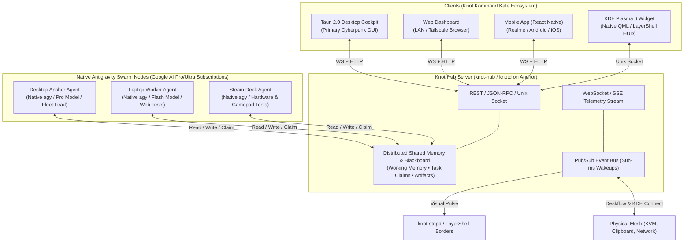

# Knot Swarm: Vision, Roadmap & Trajectory 🪢⚡

**Knot** is evolving from a local hardware mesh orchestrator into an **intelligent, heterogeneous multi-agent development swarm** powered by native Google Antigravity subscriptions and coordinated via **Knot Kommand Kafe**: a decoupled, multi-client cockpit.

---

## 🧭 The Core Thesis

Modern developer environments span multiple hardware planes with distinct specialties:
1. **Anchor Workstation (`anchor` / `workstation`)**: High-compute ultrawide workstation, heavy CPU/GPU, central origin, Swarm Brain.
2. **Heavy Mobile Strand (`laptop`)**: Modern mobile workstation with dedicated GPU, mobile developer workbench, roaming companion.
3. **Specialized Embedded Strand (`handheld`)**: APU-powered handheld form-factor, gamepad/analog input (`evdev`), Gamescope/Vulkan, low-power testbed.

By leveraging **native Antigravity sessions** (authenticated via Google AI Pro & Ultra subscriptions) and tying them together through a **Distributed Shared Memory & Event Hub**, we eliminate API token friction and coordinate heterogeneous hardware-in-the-loop workflows across the desk.

---

## 🏛 The Decoupled Swarm Architecture



---

## ⚡ Pillar 1: Subscription-Native Multi-Agent Swarm

### 1. Zero-Token-Cost Swarm (Native Antigravity Sessions)
Rather than requiring separate pay-per-token API keys, Knot utilizes the **native Antigravity sessions and subscription logins** (Google AI Pro and Ultra) already active on each device:
- Each host runs the authenticated Antigravity environment (`agy` CLI, IDE, or Desktop App).
- Context windows, reasoning tiers, and subscription quotas are leveraged directly on each machine.

### 2. Distributed Shared Memory & Blackboard Hub (`knot-hub`)
Instead of shipping entire conversational contexts across the network, agents coordinate through a lightweight **Distributed Blackboard** hosted on the Anchor:
- **Shared Working Memory**:
  - `swarm.active_goal`: High-level user objective.
  - `swarm.task_pool`: Queue of decomposed subtasks tagged with hardware capabilities (e.g. `needs: [heavy_build]`, `needs: [web_browser]`, `needs: [gamepad, vulkan]`).
  - `swarm.claims`: Locks claimed by specific node agents to prevent duplicate work.
  - `swarm.artifacts`: Shared diffs, test summaries, and findings.
- **Reactive Pub/Sub Event Bus**:
  - Eliminates polling. When the Desktop Agent deposits a task (`TASK_AVAILABLE: test_steamdeck_controls`), an event fires over the WebSocket bus.
  - The Steam Deck agent wakes instantly, claims the task, executes it via its native `agy` session, and posts `TASK_COMPLETE` back to the blackboard.

### 3. Capability-Based Task Routing Across Hardware Planes

| Hardware Plane | Machine | Native Antigravity Profile | Specialized Capabilities |
| :--- | :--- | :--- | :--- |
| **Fleet Commander (Brain)** | `desktop` | **Gemini 3.8 Pro (High Reasoning)** | Goal decomposition, repo architectural changes, multi-file refactoring, GitOps verification. |
| **Elastic Capacity (Worker)** | `laptop` | **Gemini 2.5 Flash / Fast** | Headless Chrome/Playwright tests, mobile Wi-Fi network edge testing, parallel service builds. |
| **Hardware Testbed (Embedded)** | `steamdeck` | **Gemini 2.5 Flash / Fast** | Handheld UI scaling (1280x800), `evdev` gamepad automation, Gamescope/Vulkan shader checks, battery/thermal tests. |

### 4. Living Desk Physical Feedback (`knot-stripd` Integration)
- The communication hub publishes agent lifecycle events (`AGENT_THINKING`, `TOOL_RUNNING`, `TASK_COMPLETE`).
- `knot-stripd` subscribes to these events:
  - Left display edge illuminates cyan when the Laptop agent runs tools.
  - Bottom display edge illuminates amber when the Steam Deck agent runs hardware tests.
  - Full display flashes subtle emerald upon swarm goal completion.

---

## ☕ Pillar 2: Knot Kommand Kafe (Decoupled Dashboard Architecture)

### 1. The Server-Client Decoupling Strategy
By splitting the system into a core daemon (**`knot-hub`**) and client applications, we achieve ultimate flexibility:
- **Phase 1: Tauri 2.0 Desktop Cockpit**
  - Instant development velocity using modern web tech (Vue 3 / Tailwind / Framer Motion).
  - Cyberpunk glassmorphism aesthetics, live SVG topology canvas, dynamic charts.
  - Ultra-lightweight footprint (<30MB RAM).
- **Phase 2: Universal Web Dashboard**
  - The exact same frontend served directly by `knot-hub` at `http://<anchor-ip>:42069/kafe`.
  - Accessible from any browser on the local subnet or over Tailscale/VPN without installing software.
- **Phase 3: Mobile App (React Native / Expo)**
  - Runs on your phone (e.g. your paired `realme 15 Pro 5G`).
  - Mobile push notifications for agent completion, quick goal prompts from the couch, one-tap screen lock/unlock, and live swarm telemetry.
- **Phase 4: Native KDE Plasma 6 Widget / LayerShell HUD**
  - High-performance QML / Kirigami Plasma desktop widget communicating over local Unix domain socket for zero-overhead system tray integration.

### 2. Kafe Cockpit Layout

```text
+-----------------------------------------------------------------------------------------------+
|  ☕ KNOT KOMMAND KAFE                     [MESH: 3/3 ONLINE]  [SWARM: 2 RUNNING]  [LATENCY: 1ms] |
+-----------------------------------------------------------------------------------------------+
|                                                                                               |
|  +--------------------------------+  +------------------------------------------------------+ |
|  |    SPATIAL LIVING TOPOLOGY     |  |                 SWARM BLACKBOARD HUB                 | |
|  |                                |  |                                                      | |
|  |       [ LAPTOP: 60Hz ]         |  |  Active Goal: Migrate input capture shim to v2       | |
|  |       192.168.1.102            |  |                                                      | |
|  |       Agent: [RUNNING]         |  |  [✓] Anchor: Compiled C shim & installed .so         | |
|  |       Task: Headless Web Test  |  |  [⚙] Laptop: Running integration suite               | |
|  |              ^                 |  |  [⌛] Handheld: Waiting for KVM boundary verification | |
|  |              |                 |  |                                                      | |
|  |   [ ULTRAWIDE WORKSTATION ]    |  +------------------------------------------------------+ |
|  |   workstation (Anchor)         |                                                           |
|  |   Agent: [PLANNING]            |  +------------------------------------------------------+ |
|  |   * Cursor Present *           |  |                 SYSTEM TELEMETRY RADAR               | |
|  |              |                 |  |  Anchor: CPU 14% | RAM 28GB | Tier 1 (mDNS)          | |
|  |              v                 |  |  Laptop: CPU 6%  | BAT 98%  | Tier 2 (Lease Cache)   | |
|  |       [ HANDHELD PC ]          |  |  Handheld: CPU 24% | BAT 82% | APU 49°C              | |
|  |       192.168.1.103            |  +------------------------------------------------------+ |
|  |       Agent: [IDLE / STANDBY]  |                                                           |
|  +--------------------------------+  +------------------------------------------------------+ |
|                                      |                 QUICK ACTION DECK                    | |
|  +--------------------------------+  |  [⚡ Restart KVM]   [🔒 Lock Mesh]   [📋 Sync Clip]   | |
|  |  PROMPT BAR: Order a Swarm Run |  |  [🩺 Run Doctor]   [🩹 Auto-Repair] [🖥 Wake DPMS]   | |
|  |  > "Run full mesh audio sync"  |  +------------------------------------------------------+ |
+-----------------------------------------------------------------------------------------------+
```

---

## 🗺 Phased Evolutionary Roadmap

### Phase 0: Ground-Truth Investigation & Artifact Lock-in (Completed)
- [x] Lock in architecture vision in `docs/SWARM_VISION_AND_ROADMAP.md` and commit across mesh.
- [x] Audit `agy` CLI installation, versioning, pathing, and headless capabilities across nodes.
- [x] Audit authentication mechanisms, token storage, and subscription session verification.
- [x] Design onboarding workflow and health check probes for Antigravity on all nodes.

### Phase 1: `knot-hub` Core & Antigravity Blackboard (Completed)
- [x] Build `core/hub/hub.py` and `core/hub/agent.py`:
  - Lightweight async server running on Anchor.
  - In-memory shared blackboard for task queues, node states, and heartbeat signals.
  - Pub/sub event bus with SSE streaming support for live cockpits.
- [x] Implement Lean MCP Gateway (`core/mcp/gateway.py`):
  - Model Context Protocol server over stdio connecting any `agy` session to `knot-hub`.
  - 4 canonical tools: `knot_node_status`, `knot_quota_matrix`, `knot_exec_command`, `knot_swarm_topology`.
- [x] Standardize Antigravity Skills in `runtime/skills/`:
  - Active maintained skills: `knot-swarm`, `hardware-profiles`, `swarm-council`, `goal-with-lease`.

### Phase 2: Knot Kommand Kafe (Tauri Desktop & Web UI)
- [ ] Scaffold `kafe/` with Tauri 2.0 (Rust backend + Vue 3 / Tailwind):
  - Real-time WebSocket connection to `knot-hub`.
  - Living Spatial Topology Canvas reflecting `registry/topology.json` and active KVM seats.
  - Live Telemetry Radar (CPU, battery, temperatures, ping, network tiers).
  - Quick Action Deck (KVM restart, lock/unlock, clipboard sync).
- [ ] Enable Web Serving:
  - Allow `knot-hub` to serve the compiled frontend as a web UI over LAN (`http://desktop:42069/kafe`).

### Phase 3: Swarm Autonomy & Distributed Workflows
- [ ] Automated Swarm Runbook:
  - Desktop accepts high-level prompt $\to$ breaks down tasks into blackboard.
  - Laptop claims web/test tasks $\to$ runs in headless Chrome.
  - Steam Deck claims hardware tasks $\to$ simulates inputs and reports results.
- [ ] Stripd Visual Pulse:
  - Link `knot-hub` agent events directly to `knot-stripd` for physical screen border lighting.

### Phase 4: Mobile & KDE Native Extensions
- [ ] React Native / Expo Mobile App:
  - Connect to `knot-hub` from your phone over local Wi-Fi or WireGuard/Tailscale.
  - View live swarm progress, receive task completion alerts, remote screen lock.
- [ ] KDE Plasma 6 Native Panel Widget:
  - Minimalist QML Plasma panel applet for quick status glance and cursor lock toggles.
