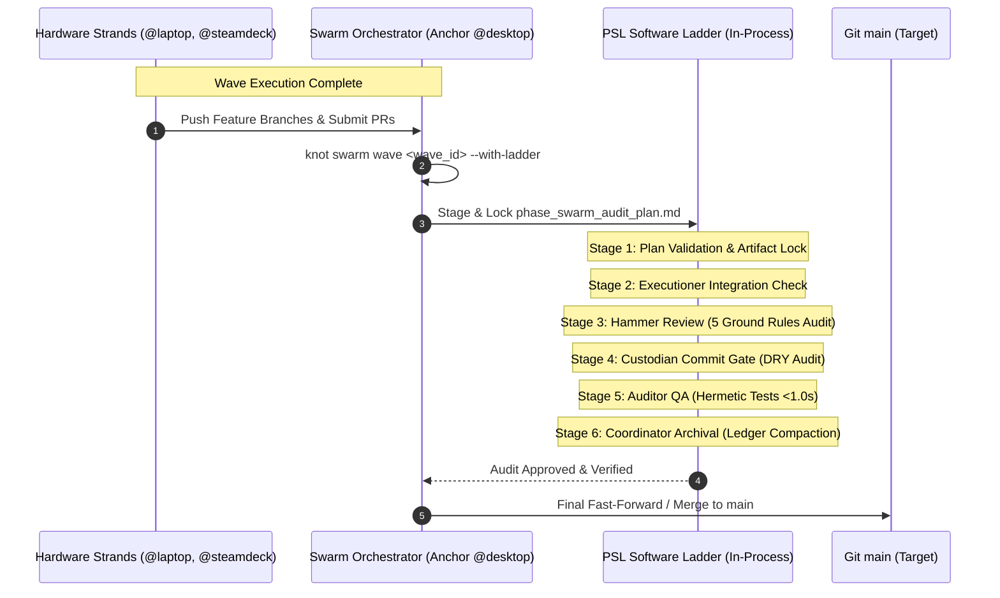

# Swarm Orchestrator: Triadic Campaign Coordination Protocol 🛰️🎼

The **Swarm Orchestrator** skill formalizes the operational coordination model for multi-day, long-horizon autonomous engineering campaigns across the physical Knot hardware mesh:

$$\text{Human Operator} \quad \boldsymbol{\longleftrightarrow} \quad \text{Swarm Orchestrator (Anchor Lead Agent)} \quad \boldsymbol{\longleftrightarrow} \quad \text{Swarm Members (Physical Strands)}$$

Codified from real-world campaigns across diverse heterogeneous nodes (Desktop Anchor, Laptop CUDA, ROG Ally APU, Steam Deck APU), this protocol grounds execution directly in Knot Mesh's native tooling ([`docs/CLI_REFERENCE.md`](docs/CLI_REFERENCE.md)), fleet operations architecture ([`docs/SWARM_OPERATIONS.md`](docs/SWARM_OPERATIONS.md)), and swarm roadmap vision ([`docs/SWARM_VISION_AND_ROADMAP.md`](docs/SWARM_VISION_AND_ROADMAP.md)).

---

## 1. Tooling Ecosystem & Peer Skill Interplay

The Swarm Orchestrator is **fully runnable** because it composes Knot Mesh's existing production CLI modules, MCP gateways, and operational skills rather than reinventing ad-hoc scripts:

```mermaid
graph TD
    classDef orch fill:#2a1b4e,stroke:#9d4edd,stroke-width:2px,color:#fff;
    classDef peer fill:#1e293b,stroke:#38bdf8,stroke-width:1.5px,color:#e2e8f0;
    classDef tool fill:#0f172a,stroke:#34d399,stroke-width:1.5px,color:#e2e8f0;

    Orch["Swarm Orchestrator<br>(runtime/skills/swarm-orchestrator)"]:::orch

    subgraph "Peer Operational Skills"
        HW["hardware-profiles<br>(Node personas, CUDA/Vulkan roles)"]:::peer
        SwarmSkill["knot-swarm<br>(0-token CLI vs Linda fanout)"]:::peer
        Council["swarm-council<br>(Kitty Confluence, Discussions)"]:::peer
        Ladder["subagent-ladder<br>(Executioner -> Hammer -> Auditor)"]:::peer
        Lease["goal-with-lease<br>(Leased autonomy contracts)"]:::peer
    end

    subgraph "Native Knot Mesh Tooling & Daemons"
        KnotCLI["knot CLI (bin/knot)<br>(sleep, quota, auth, worktree, screen)"]:::tool
        Steer["knot council steer<br>(Stdin pipe, return key release, ack)"]:::tool
        GitOps["core/gitops.sh<br>(knot worktree add/provision)"]:::tool
        Board["knot council board / live quota<br>(Handheld real-time visualizers)"]:::tool
        MCP["core/mcp/gateway.py<br>(knot_node_status, knot_exec_command)"]:::tool
    end

    Orch -->|Adopts hardware roles| HW
    Orch -->|Dispatches zero-token commands| SwarmSkill
    Orch -->|Steers panes via bridge| Steer
    Orch -->|Provisions isolated trees| GitOps
    Orch -->|Deploys handheld monitors| Board
    Orch -->|Inspects topology & metrics| MCP
    Orch -->|Invokes ladder on worker PRs| Ladder
    Orch -->|Enforces lease boundaries| Lease
```



### 1.1 The Operational Skill Matrix

| Skill | Interaction with Swarm Orchestrator | Canonical Path |
| :--- | :--- | :--- |
| **`hardware-profiles`** | Used during task staging to inject node-specific system prompts (e.g. CUDA on `@laptop`, heavy compile on `@desktop`, handheld APU on `@steamdeck`). | [`runtime/skills/hardware-profiles/SKILL.md`](../hardware-profiles/SKILL.md) |
| **`knot-swarm`** | Provides 0-token CLI commands (`knot_exec_command`) and Linda Tuplespace batch fanouts (`knot_task_fanout`). | [`runtime/skills/knot-swarm/SKILL.md`](../knot-swarm/SKILL.md) |
| **`swarm-council`** | Manages Kitty Confluence spatial multiplexing (`scripts/confluence.py`), delta discussion querying (`scripts/gh_discussion.py`), and prompt delivery (`scripts/deliver.sh`). | [`runtime/skills/swarm-council/SKILL.md`](../swarm-council/SKILL.md) |
| **`subagent-ladder`** | Invoked inside worker strands when executing complex multi-file SWE tasks to ensure builder/auditor separation. | [`runtime/skills/subagent-ladder/SKILL.md`](../subagent-ladder/SKILL.md) |
| **`goal-with-lease`** | Binds the campaign to PSL Gold Standard invariants ([`AGENTS.md`](../../../AGENTS.md)) and leased autonomy boundaries. | [`runtime/skills/goal-with-lease/SKILL.md`](../goal-with-lease/SKILL.md) |

---

## 2. The Triad Architecture & Behavioral Invariants

```text
┌────────────────────────────────────────────────────────────────────────────────────────┐
│                                 1. THE HUMAN OPERATOR                                  │
│  • Enjoys unencumbered workstation monitors for private work while away or at desk.   │
│  • Enforces wholesale AC power sleep inhibition across the entire physical mesh.       │
│  • Receives tiered escalations (P0 Blocker, P1 Attention Quarantine, P2 Silent Ledger).│
│  • Intervenes strictly at high-leverage gates (auth rotation, architectural blockers). │
└───────────────────────────────────────────┬────────────────────────────────────────────┘
                                            │ High-Signal Steering & Policy Leases
                                            ▼
┌────────────────────────────────────────────────────────────────────────────────────────┐
│                        2. THE SWARM ORCHESTRATOR (ANCHOR LEAD)                         │
│  • Strictly enforces the CONDUCTOR INVARIANT: Stages tasks, dispatches, audits PRs.    │
│  • NEVER writes code or runs unit tests directly when worker strands have capacity.     │
│  • Halts immediately upon total worker exhaustion (Tier 2 Stop-and-Inquire).           │
│  • Modulates visual monitoring cadence via the Adaptive Resolution Gradient.           │
│  • Maintains the living Operator Ledger artifact (operator_ledger.md).                 │
│  • Enforces 10m review delay fences, fetches review deltas, executes --merge commits.  │
│  • Synchronizes main git tree across all physical worktrees before next task branch.  │
└───────────────────────────────────────────┬────────────────────────────────────────────┘
                                            │ Staged Prompts via Stdin & Screen Telemetry
                                            ▼
┌────────────────────────────────────────────────────────────────────────────────────────┐
│                          3. THE SWARM MEMBERS (HARDWARE STRANDS)                       │
│  • Execute atomic tasks in isolated git worktrees aligned with hardware profile.      │
│  • Ingest staged prompts via clean --stdin double-return buffer release protocols.     │
│  • Report concise milestone checkpoints (< 15-20 lines) to avoid token burn.          │
│  • Focus single-mindedly on execution, test passes, and PR creation.                  │
└────────────────────────────────────────────────────────────────────────────────────────┘
```

### 2.1 The Human Operator Rights & Ergonomics
1. **Unencumbered Workstation Monitor**:
   - The operator's primary desktop screens are reserved for personal human productivity.
   - Visual agent cockpits (Kitty Confluence, live terminals) must **never hijack, resize, or obstruct** the operator's primary display. Cockpits are decoupled to secondary worker displays (e.g. `@laptop` `WAYLAND_DISPLAY=wayland-0` or auxiliary handheld displays) or confined to secondary virtual workspaces (`Workspace 2+`).
2. **Whole-Swarm Sleep Inhibition**:
   - Long-horizon campaigns must continue executing uninterrupted overnight or when the operator steps away.
   - System sleep, suspend-on-idle, and power-saving dimming must be inhibited across all online nodes on AC power via `knot sleep prevent` ([`docs/CLI_REFERENCE.md:376-383`](docs/CLI_REFERENCE.md#knot-sleep)).
3. **High-Signal Intervention Only**:
   - The operator must not be spammed with routine progress narration or trivial confirmations.
   - Autonomous execution halts and alerts the human operator strictly upon **Tier 1** (breaking architectural decisions) and **Tier 2** (unresolvable environment faults, credential rotation) triggers.

### 2.2 The Swarm Orchestrator: The Conductor Invariant
> [!CRITICAL]
> **The Conductor Invariant (Zero Lone-Ranger Execution)**:
> The Swarm Orchestrator functions exclusively as **conductor and campaign general manager**.
> If worker strands are online and have available quota:
> - The Orchestrator is **STRICTLY FORBIDDEN** from editing source files, writing implementation code, or running local unit test suites directly on the anchor node.
> - The Orchestrator's sole duties are: decomposing requirements, provisioning worktrees via `knot worktree add`, staging prompt specifications, dispatching tasks via `knot council steer`, monitoring progress, conducting delta code reviews, enforcing reviewer delay fences, and executing mainline merges.
> - **Failure Escalation**: If all worker strands are offline, disconnected, or quota-exhausted, the Orchestrator **MUST NOT** fall into the trap of becoming a solitary worker. It must halt execution and issue a **Tier 2 Stop-and-Inquire escalation** to the human operator.

### 2.3 The Swarm Members: Strand Ergonomics & Clean Handoffs
1. **Hardware-Aligned Workstream Allocation** ([`docs/SWARM_VISION_AND_ROADMAP.md:78-85`](docs/SWARM_VISION_AND_ROADMAP.md)):
   - Heavy compilation & memory-intensive workloads $\longrightarrow$ Desktop Anchor or high-core Ryzen APU.
   - PyTorch, CUDA, tensor models, and local LLM offloads $\longrightarrow$ `@laptop` (NVIDIA RTX 3050 CUDA).
   - Handheld UX, Vulkan/RADV testing, and lightweight jobs $\longrightarrow$ `@steamdeck` / `@rog-ally`.
2. **Clean Staged Prompt Buffer Ingestion**:
   - Worker agents run interactive `agy` TUIs inside terminal panes.
   - Prompts must be staged through file writes and dispatched via `--stdin` with double-return sequences (`knot council steer`) to guarantee the interactive buffer transitions from `> ↑ N more lines` to active turn execution without hanging.
3. **Concise Milestone Checkpoints**:
   - Worker updates must be strictly bounded under **15–20 lines** (`STATUS: 25%|50%|75%|FINAL`), highlighting liveness, ETA, and red-flag regressions without pasting large raw logs.

---

## 3. Mesh Pre-Flight, Workspace Discipline & Handheld Telemetry

Before dispatching tasks or launching a campaign, the Orchestrator executes a deterministic pre-flight sweep using native `knot` commands.

### 3.1 Sleep Inhibition Enforcement
Prevent swarm strands from sleeping or turning off screens while running on AC power:

```bash
# 1. Enforce swarm-wide sleep prevention (docs/CLI_REFERENCE.md)
knot sleep prevent "Campaign: <Campaign-Name>"

# 2. Verify sleep inhibition status across nodes
knot sleep status
```

### 3.2 Fleet Quota & Hardware Sweep
Inspect real-time token quotas and model allocation across all nodes in a single non-blocking pass:

```bash
# One-shot render of real-time 5-hour and weekly token quotas (docs/CLI_REFERENCE.md:470)
knot quota live --render-once

# Full tabular output across all nodes
knot quota --all

# Confirm physical node status, hardware backend, and network latency
knot status
```

Or invoke via native Antigravity MCP gateway:
```python
# Call MCP tool for zero-overhead topology snapshot
knot_swarm_topology()
```

### 3.3 Handheld Display Allocation (Steam Deck / ROG Ally)
Handheld screens (`eDP-1`) provide ideal non-intrusive monitoring surfaces while the operator is away from the workstation ([`docs/SWARM_OPERATIONS.md:178-181`](docs/SWARM_OPERATIONS.md)):
- **Live Compact Quota Visualizer**: Runs `knot quota live --compact` (specifically engineered for $\le 80$ columns).
- **Live Council Message Board**: Runs `knot council board --compact` to display real-time strand communication.

```bash
# Deploy compact telemetry dashboard on handheld display (e.g. Steam Deck)
knot exec steamdeck "nohup env WAYLAND_DISPLAY=wayland-0 kitty --hold -e knot quota live --compact </dev/null >/dev/null 2>&1 &"
knot exec steamdeck "nohup env WAYLAND_DISPLAY=wayland-0 kitty --hold -e knot council board --compact </dev/null >/dev/null 2>&1 &"
```

---

## 4. Multiplexed Cockpit & Staged Prompt Dispatch

To honor the Human Operator's right to an unencumbered workstation monitor, the visual cockpit is decoupled from the primary screen.

### 4.1 Display Targeting Strategy
1. **Targeting Rule**:
   - Route visual multiplexer cockpits (Kitty Confluence) to an active worker node's Wayland display (e.g. `@laptop` `WAYLAND_DISPLAY=wayland-0` or handheld display).
   - Fallback: If no remote display is reachable, launch on the Anchor node strictly bound to a secondary virtual desktop (e.g. `Workspace 2+`), never on the primary active workspace.

### 4.2 Decoupled Cockpit Launch & Kitty Remote Control
To launch a decoupled cockpit on a worker display without blocking the SSH channel:

```bash
# Launch decoupled council cockpit on worker display (e.g. laptop)
knot exec laptop "nohup env WAYLAND_DISPLAY=wayland-0 kitty -o allow_remote_control=yes --listen-on unix:/tmp/kitty-council-${RUN_ID}.sock </dev/null >/dev/null 2>&1 &"
```
Instead of manual SSH cloning, the Orchestrator provisions isolated worktrees across nodes using Knot's native GitOps module ([`core/gitops.sh:260`](core/gitops.sh) and [`docs/CLI_REFERENCE.md:589`](docs/CLI_REFERENCE.md)):

```bash
# Provision isolated git worktree across target worker nodes without duplicate clones
knot worktree add knot-mesh "task_${TASK_ID}" --branch "feat/${FEATURE_NAME}" --nodes "laptop,steamdeck"

# Verify active worktrees across fleet
knot worktree list
```

### 4.3 Staged Prompt Delivery via `knot council steer`
The Orchestrator dispatches prompts using `knot council steer` ([`core/modules/council.sh:430-520`](core/modules/council.sh)), which natively handles stdin piping, target socket routing, and return key buffer submission:

```bash
# Step 1: Stage prompt markdown file on disk
cat << 'EOF' > /tmp/knot/prompts/task_${TASK_ID}.md
You are executing Task #${TASK_ID} on branch feat/${FEATURE_NAME}.
Ground Rules:
1. Work exclusively inside the designated worktree (~/Dev/knot-mesh/worktrees/task_${TASK_ID}).
2. Adhere strictly to the PSL Gold Standard in AGENTS.md.
3. Adopt the hardware profile for your node (runtime/skills/hardware-profiles/SKILL.md).
4. Run verification test suites before committing.
EOF

# Step 2: Dispatch prompt cleanly via knot council steer with turn-state acknowledgement
cat /tmp/knot/prompts/task_${TASK_ID}.md | \
  knot council steer --wait-ack 30 "$NODE_ID" "$RUN_ID"
```

If steering directly via the underlying Kitty remote control socket (`/tmp/kitty-council-${RUN_ID}.sock`):
```bash
# Stream prompt via stdin to target pane matching window title
printf '%s\r' "$(< /tmp/knot/prompts/task_${TASK_ID}.md)" | \
  kitty @ --to "unix:/tmp/kitty-council-${RUN_ID}.sock" send-text --match "title:.*${NODE_ID}.*" --stdin

# Wait 200ms for buffer ingestion
sleep 0.2

# Dispatch double-return submission keys to release prompt buffer into LLM turn
kitty @ --to "unix:/tmp/kitty-council-${RUN_ID}.sock" send-key --match "title:.*${NODE_ID}.*" return
sleep 0.1
kitty @ --to "unix:/tmp/kitty-council-${RUN_ID}.sock" send-key --match "title:.*${NODE_ID}.*" return
```

---

## 5. Adaptive Visual Telemetry (Resolution Gradient)

The Orchestrator monitors worker execution via screen telemetry without blind polling loops. The monitoring frequency dynamically adapts according to the **Adaptive Resolution Gradient**:

$$\text{Activity Urgency} \quad \Longrightarrow \quad \Delta t_{\text{cadence}}$$

```text
┌────────────────────────────────────────────────────────────────────────┐
│                        THE RESOLUTION GRADIENT                         │
├────────────────────────────────┬───────────────────────────────────────┤
│ RELAXED CADENCE (120s / 2m)    │ • Long compile / test suite execution │
│                                │ • Waiting on PR review 10m delay fence│
│                                │ • Idle worker waiting for task pickup │
├────────────────────────────────┼───────────────────────────────────────┤
│ URGENT CADENCE (15s – 30s)     │ • Active interactive command run      │
│                                │ • Anomaly healing / compile recovery  │
│                                │ • New reviewer comment arrival        │
│                                │ • PR merge readiness checks           │
└────────────────────────────────┴───────────────────────────────────────┘
```

### 5.1 Wayland Multi-Screen Captures via Spectacle
Capture raw screen state across physical nodes headlessly matching Knot Hub's screenshot engine ([`core/hub/hub.py:395-431`](core/hub/hub.py)):

```bash
# Capture remote worker screen (e.g. laptop) without waking physical monitor backlights
ssh laptop "WAYLAND_DISPLAY=wayland-0 spectacle -b -n -o /tmp/knot_screen_laptop.png"

# Fetch capture back to anchor for inspection
scp laptop:/tmp/knot_screen_laptop.png /tmp/telemetry/laptop_current.png
```

Visual inspections verify:
- Whether the interactive TUI is actively streaming output or stuck on a prompt modal (`[Y/n]`).
- Screen state (unlocked vs. locked/dimmed via `knot screen status`).

---

## 6. PR Review Delta & Git Lifecycle Governance

When a worker strand completes its task and pushes a feature branch, the campaign enters the **Review Delta & Git Lifecycle** phase.

```text
┌────────────────────────────────────────────────────────────────────────┐
│ 1. PR Created by Worker Strand                                         │
│    `gh pr create --title "feat(core): ..." --body "..."`               │
├────────────────────────────────────────────────────────────────────────┤
│ 2. Mandatory 10-Minute Automated Review Delay Fence                    │
│    • Set timer for 10 minutes. Do NOT merge prematurely.               │
│    • Await automated reviewers (Copilot, Gemini Code Assist, bots).    │
│    • Resolution Gradient: RELAXED (120s check).                        │
├────────────────────────────────────────────────────────────────────────┤
│ 3. Fetch Review Delta Comments                                         │
│    • Query GitHub API for all review threads & line comments.          │
│    • Classify comments: Actionable Fix vs. Informational.              │
├────────────────────────────────────────────────────────────────────────┤
│ 4. Dispatch Targeted Fixes to Authoring Strand                        │
│    • Send actionable comments back to authoring strand worktree.       │
│    • Authoring strand implements fix + tests, pushes commit.           │
│    • Orchestrator replies to thread explaining resolution.             │
├────────────────────────────────────────────────────────────────────────┤
│ 5. Structured Review Summary & Mainline Merge                          │
│    • Post standardized review summary comment on PR.                   │
│    • Execute autonomous merge via --merge commit (all checks green).   │
├────────────────────────────────────────────────────────────────────────┤
│ 6. Fleet-Wide Eager Worktree Synchronization                           │
│    • Run `git checkout main && git pull origin main` on ALL nodes.     │
│    • Zero tree divergence before dispatching downstream child tasks.   │
└────────────────────────────────────────────────────────────────────────┘
```

### 6.1 The 10-Minute Review Delay Fence
Automated review bots (GitHub Copilot, Gemini Code Assist, Linters) typically post comprehensive reviews within 5 to 10 minutes of PR creation.
- **Rule**: Merging before the 10-minute window elapses is strictly forbidden.
- While waiting, the Orchestrator scales its telemetry to the **Relaxed Cadence (120s)**.

### 6.2 Fetching Review Deltas via GitHub CLI & API
Query PR review comments and issue comments:

```bash
# Fetch PR reviews and top-level comments
gh pr view "$PR_NUMBER" --json reviewRequests,reviews,comments,statusCheckRollup

# Fetch inline code review comments with line numbers using GitHub CLI native path substitution
gh api "repos/:owner/:repo/pulls/${PR_NUMBER}/comments" \
  --jq '.[] | {id: .id, path: .path, line: .line, body: .body, user: .user.login}'
```

### 6.3 Thread Resolution & Fix Dispatch
1. If actionable feedback is identified:
   - Dispatch the feedback directly to the **authoring worker strand** in its active worktree (`knot council steer "$NODE_ID" "$FEEDBACK_PROMPT"`).
   - The worker strand amends or adds a verified, signed commit (`git commit -S -m "fix(scope): address review feedback"`).
   - Once pushed, the Orchestrator replies to the review thread:
     ```bash
     gh api --method POST "repos/:owner/:repo/pulls/${PR_NUMBER}/comments/${COMMENT_ID}/replies" \
       -f body="Addressed in commit $(git rev-parse --short HEAD). Automated test suite re-verified clean."
     ```

### 6.4 Standardized PR Review Summary Comment
Before merging, the Orchestrator posts a standardized summary comment:

```markdown
### 🛰️ Swarm Orchestrator — Final Review Summary
- **Target Branch**: `main`
- **Verification Proofs**: All unit/integration tests verified green on physical strand `@<node_id>`.
- **Reviewer Feedback**:
  - Automated Reviewers: Addressed and verified (10m delay fence observed).
  - Code Hygiene: 0 error swallowing (`2>/dev/null`), 0 mock shortcuts, clean type signatures.
- **Merge Mode**: Mainline merge commit (`--merge`) preserving GPG signatures and commit lineage.
```

### 6.5 Autonomous Merge Policy
- **Merge Mode**: Fully autonomous merge via `--merge` commits:
  ```bash
  gh pr merge "$PR_NUMBER" --merge --auto
  # Or immediate merge if all requirements satisfied:
  gh pr merge "$PR_NUMBER" --merge
  ```
- **Merge Invariant**: All CI status checks must be green, and all reviewer comments (GitHub PR comments and local agentic reviews) must be marked addressed.
- **Escalate to Operator**: If merge conflicts occur, CI fails repeatedly, or architectural disagreements persist after 2 review cycles, escalate immediately to the human operator.

### 6.6 Fleet-Wide Eager Worktree Synchronization
Immediately after merging a PR into `main`, the Orchestrator executes a swarm-wide tree synchronization before dispatching any child issues:

```bash
# Fleet-wide eager sync across all online physical nodes (docs/CLI_REFERENCE.md:209)
knot exec --all "cd \"\$HOME/Dev/knot-mesh\" && git checkout main && git pull origin main"
```

This guarantees zero branch divergence or merge collisions when downstream tasks branch from `main`.

---

## 7. Tiered Operator Escalation Matrix & Multi-Channel Notifications

Escalations are categorized into three clear operational tiers to protect operator focus:

| Tier | Urgency & Impact | Triggers & Examples | Orchestrator Action | Notification & Delivery Channels |
| :--- | :--- | :--- | :--- | :--- |
| **P0 (Tier 1)** | **Hard Blocker**<br>*(Immediate Intervention)* | • Expired OAuth token requiring browser login (`knot auth login`)<br>• Git push rejected by branch protection or missing credentials<br>• Secret Service / KWallet hard lockout (`knot auth test-lock` fails)<br>• Hardware/kernel failure (GPU bus reset, NVMe read-only)<br>• Breaking architectural decisions / contract migrations | **Halts campaign** on affected branch immediately.<br>Enters paused state awaiting human steering. | • `notify-send -u critical -a "Knot Orchestrator"` on Anchor<br>• Automated KDE Connect push: `kdeconnect-cli --ping-msg "KNOT P0: <issue>"` to operator phone/handheld<br>• Terminal audio bell (`printf '\a'`)<br>• Pinned to Top of `operator_ledger.md` |
| **P1 (Tier 2)** | **Needs Attention**<br>*(Graceful Degradation)* | • Specific worker strand quota depleted (without auto-switch fallback)<br>• 2-cycle review debate deadlock on a PR<br>• Flaky non-critical test suite or isolated compile failure | **Quarantines affected task/PR** to Operator Attention queue in ledger.<br>**Continues parallel tasks** on unblocked strands. | • `notify-send -u normal -a "Knot Orchestrator"`<br>• Logged in `operator_ledger.md` Action Required queue<br>• Yellow visual indicator in cockpit |
| **P2 (Tier 3)** | **Informational / Ack**<br>*(Async Digest)* | • Milestones reached (25%, 50%, 75%, FINAL)<br>• PR created or merged via `--merge`<br>• Fleet-wide worktree sync completed<br>• Self-healed event (auto-auth switched, screen PAM unlocked) | **Zero interruption**.<br>Silently recorded to campaign ledger. | • Passive update in `operator_ledger.md`<br>• Displayed on handheld telemetry card |

### 7.1 Multi-Channel Blocker Delivery Protocol
When a P0 blocker is encountered, the Orchestrator emits notifications across all active channels:

```bash
# 1. Anchor desktop notification
notify-send -u critical -a "Knot Orchestrator" "HARD BLOCKER: Quota Depleted" "All profiles on @laptop exhausted. Awaiting operator auth refresh."

# 2. KDE Connect push notification to operator's mobile / handheld (docs/SWARM_OPERATIONS.md:215-242)
if command -v kdeconnect-cli >/dev/null; then
  local dev_list=""
  if dev_list="$(kdeconnect-cli -a --id-only 2>&1)"; then
    while IFS= read -r dev; do
      [ -n "$dev" ] && kdeconnect-cli -d "$dev" --ping-msg "Knot Mesh P0: Hard Blocker on @laptop - manual auth required"
    done <<< "$dev_list"
  fi
fi

# 3. Audio terminal bell chime in cockpit
printf '\a'
```

### 7.2 Operator Resolution Signaling
The operator can signal resolution through either of two channels:
1. **Environmental Auto-Detection**: The Orchestrator periodically probes for resolved conditions (e.g. `knot auth test-lock` returns 0, new commits detected on branch, or node returns online) and un-quarantines the task autonomously.
2. **Direct Chat Instruction**: The operator sends a direct chat prompt (e.g., *"Resolved auth on laptop, continue campaign"* or *"Skip task 4 and proceed with 5"*).

---

## 8. Living Operator Ledger Artifact (`operator_ledger.md`)

Throughout every campaign, the Orchestrator maintains an ongoing, living artifact document at:
`<appDataDir>/brain/<conversation-id>/operator_ledger.md`

### 8.1 Ledger Layout Standard
The ledger must adhere strictly to the following pinned structure:

```markdown
# 🛰️ Swarm Campaign Operator Ledger
**Campaign**: <Campaign Name> | **Run ID**: `<run_id>` | **Status**: ACTIVE | **Last Sync**: <Timestamp>

---

## 🚨 Action Required / Escalations Queue (Pinned)
*Items in this queue require operator decision or manual intervention.*

| Priority | Node | Workstream / Task | Trigger / Issue | Status | Action Required |
| :---: | :---: | :---: | :---: | :---: | :--- |
| **P0** | `@laptop` | Task #3 (CUDA Offload) | OAuth token expired | **BLOCKED** | Run `knot auth login secondary` in terminal |
| **P1** | `@steamdeck` | PR #64 (Vulkan Bench) | Review deadlock (2 cycles) | **QUARANTINED** | Review diff in PR #64 and choose merge path |

---

## 🗺️ Active Tasks & Strand Allocation Matrix

| Node | Hardware Role | Assigned Task | Branch | Elapsed | Telemetry Cadence |
| :--- | :--- | :--- | :--- | :---: | :---: |
| `@desktop` | Anchor / Coordinator | Orchestrating Campaign | `main` | 4h 12m | 120s (Relaxed) |
| `@laptop` | CUDA Inference | Task #3 (Paused) | `feat/cuda-ops` | 1h 45m | Quarantined |
| `@steamdeck` | Low-Power Handheld | Handheld Telemetry | — | 3h 50m | 120s (Relaxed) |

---

## 📈 Milestones & PR Lifecycle Tracker

- [x] **Milestone 1**: Core topology reconciliation & sleep lock (`knot sleep prevent`)
- [x] **PR #62**: `feat(core): add hardware profile detectors` — Merged via `--merge` (`a1b2c3d`)
- [ ] **PR #64**: `feat(vulkan): handheld benchmark suite` — 10m review delay fence passed; in review resolution
- [ ] **Milestone 2**: Final synthesis and release validation

---

## 🩹 Anomaly & Self-Healing Log

| Timestamp | Node | Anomaly Event | Automated Remediation | Verdict |
| :--- | :---: | :--- | :--- | :---: |
| 01:15:22 | `@laptop` | Primary token quota exhausted | Auto-switched to `secondary` profile via `knot auth switch` | HEALED |
| 02:40:10 | `@steamdeck` | Display dimmed / session locked | Screen unlocked via PAM credentials (`knot screen unlock`) | HEALED |

---

## 🔋 Fleet Token Quota Snapshot

| Node | Active Profile | 5-Hour Quota Remaining | Weekly Quota Remaining | Keyring State |
| :--- | :--- | :---: | :---: | :---: |
| `@desktop` | `primary` | 82% | 91% | Unlocked |
| `@laptop` | `secondary` | 64% | 78% | Unlocked |
| `@steamdeck` | `primary` | 95% | 97% | Unlocked |
```

---

## 9. 4-Stage Crash, Power Loss & Quota Recovery

During multi-day campaigns, unforeseen power dropouts, node reboots, or network partitions will occur. The Orchestrator follows a rigorous **4-Stage Swarm Reconciliation & Recovery Sequence** leveraging Knot's self-healing modules ([`docs/SWARM_OPERATIONS.md:186-242`](docs/SWARM_OPERATIONS.md)):

```text
┌────────────────────────────────────────────────────────────────────────┐
│ STAGE 1: Network & Mesh Sync                                           │
│   • Run `knot sync --all` and `knot status`                            │
│   • Reconcile SSH keys, mDNS resolutions, and node liveness            │
├────────────────────────────────────────────────────────────────────────┤
│ STAGE 2: Worktree & Commit Salvage                                     │
│   • SSH to recovered node and inspect git worktree status              │
│   • Detect unpushed commits (`git log origin/main..HEAD`)              │
│   • Detect dirty unstaged files (`git status --porcelain`)             │
│   • Commit and push salvage branch if partial progress exists          │
├────────────────────────────────────────────────────────────────────────┤
│ STAGE 3: Session Re-Attachment & Listener Respawn                      │
│   • Probe Kitty remote control socket: `test -S /tmp/kitty-*.sock`     │
│   • Resume session via `knot council resume <run_id>`                   │
│   • Relaunch Kitty multiplexer listener if previous process terminated │
├────────────────────────────────────────────────────────────────────────┤
│ STAGE 4: Ledger Reconciliation & Resumption                            │
│   • Reconcile `operator_ledger.md` against recovered git state         │
│   • Resume campaign from last verified milestone (Zero Duplicate Work) │
└────────────────────────────────────────────────────────────────────────┘
```

### 9.1 Recovery Commands
```bash
# Stage 1: Re-sync mesh state and heal dev drift (docs/CLI_REFERENCE.md:12)
knot sync --all
knot status

# Stage 2: Inspect recovered strand worktree
knot exec laptop "cd \"\$HOME/Dev/knot-mesh\" && git status && git log -1 --stat"

# Stage 3: Resume council session (docs/CLI_REFERENCE.md:393)
knot council resume "$RUN_ID"

# Stage 4: Update ledger and resume dispatch
```

---

## 10. Native `--with-ladder` Quality Pipeline Integration (Issue #68)

To eliminate the architectural gap between physical multi-node hardware orchestration and in-process software verification, the Swarm Orchestrator provides native `--with-ladder` quality pipeline integration via `knot swarm wave <wave_id> --with-ladder`:



### 10.1 The Architectural Demarcation Guard
The Swarm Orchestrator enforces a strict separation of concerns:
- **Physical Hardware Orchestration**: Knot Swarm coordinates remote task execution, dynamic telemetry monitoring, CUDA/Vulkan profiling, and worktree synchronization across physical hardware nodes.
- **Software Quality Verification**: The PSL 6-Stage Software Ladder operates strictly locally and in-process on the Anchor workstation (`@desktop`), auditing the merged changes against the PSL 5 Ground Rules, running clean-room unit tests, and verifying zero error swallowing before code reaches `main`.

### 10.2 Wave Closure CLI Invocations
```bash
# Preview wave closure and staged audit plan
knot swarm wave wave-3 --with-ladder --dry-run

# Execute full wave closure with PSL 6-stage Software Ladder gate
knot swarm wave wave-3 --with-ladder
```

---

## 11. Operational Checklist for Campaigns

Track campaign lifecycle using this comprehensive checklist:

```text
[ ] Pre-Flight:
    [ ] knot sleep prevent "Campaign: <name>" (Fleet sleep lock)
    [ ] knot quota --all (Verify 5h & weekly quota capacity)
    [ ] knot status (All required physical strands online)
[ ] Cockpit & Telemetry Setup:
    [ ] Decouple cockpit to worker display (@laptop wayland-0 or secondary virtual workspace)
    [ ] Initialize Operator Ledger artifact (operator_ledger.md)
    [ ] Deploy compact monitors to handhelds: knot quota live --compact & knot council board --compact
[ ] Task Dispatch (The Conductor Invariant):
    [ ] Orchestrator drafts task & implementation spec
    [ ] Provision isolated worktree: knot worktree add knot-mesh <task_id> --nodes <target_nodes>
    [ ] Pipe prompt cleanly via knot council steer --wait-ack 30 <node_id> <run_id>
    [ ] Verify strand TUI starts active turn execution
[ ] Steering & Telemetry (Resolution Gradient):
    [ ] Relaxed (120s): Compile, lengthy tests, review delay window
    [ ] Urgent (15s-30s): Command execution, reviewer arrival, error healing
    [ ] Wayland spectacle captures when visual verification needed
[ ] Escalations & Quarantine:
    [ ] P0 Blocker: Halt branch, notify-send -u critical, kdeconnect ping-msg, audio chime
    [ ] P1 Attention: Quarantine task to operator_ledger.md, continue parallel tasks
    [ ] P2 Informational: Log silently to ledger
[ ] PR & Merge Gate:
    [ ] Honor 10-minute merge delay fence for automated review bots
    [ ] Fetch review deltas via GitHub API
    [ ] Dispatch fixes back to authoring strand worktree
    [ ] Reply to resolved review threads
    [ ] Post standardized review summary comment
    [ ] Execute gh pr merge --merge (all greens)
[ ] Wave Closure (The Software Ladder Gate):
    [ ] Run knot swarm wave <wave_id> --with-ladder
    [ ] Verify Stage 1-6 PSL Software Ladder audit passes on Anchor
[ ] Post-Merge Tree Parity:
    [ ] Run fleet-wide eager sync: knot exec --all "git checkout main && git pull origin main"
    [ ] Proceed to next backlog issue
[ ] Outage Recovery (if needed):
    [ ] Execute 4-Stage Reconciliation (Sync -> Salvage -> Re-attach -> Ledger)
```

---

## 12. Canonical Documentation References

For in-depth operational mechanics, refer to the authoritative manuals in the repository:
- **CLI Reference Guide**: [`docs/CLI_REFERENCE.md`](docs/CLI_REFERENCE.md) — Comprehensive documentation of all Tier 0 to Tier 3 subcommands (`knot sleep`, `knot quota`, `knot auth`, `knot worktree`, `knot screen`, `knot council`).
- **Fleet Operations Manual**: [`docs/SWARM_OPERATIONS.md`](docs/SWARM_OPERATIONS.md) — Declarative swarm architecture, network roaming guards, PAM sudo gates, multi-tenant profile sandboxing (`knot auth`), and full-mesh KDE Connect clipboard synchronization.
- **Vision & Roadmap**: [`docs/SWARM_VISION_AND_ROADMAP.md`](docs/SWARM_VISION_AND_ROADMAP.md) — Architectural roadmap covering decoupled cockpits (Knot Kommand Kafe), subscription-native multi-agent coordination, and hardware plane routing.
- **Engineering Governance**: [`AGENTS.md`](AGENTS.md) — PSL Gold Standard, 5 Ground Rules of Engineering Integrity, and Leased Autonomy Contracts.
